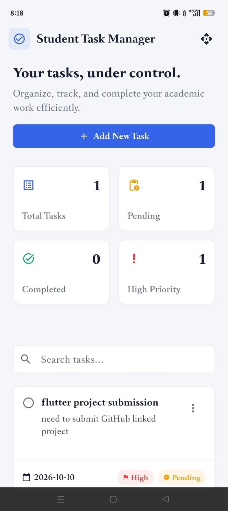
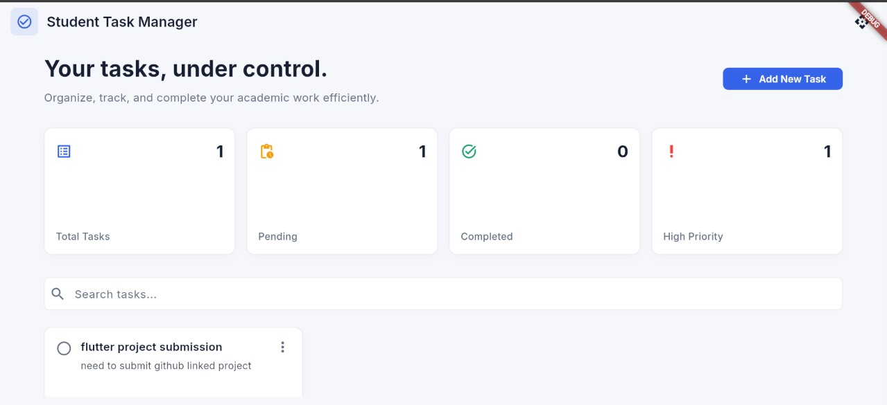

# Student Task Manager

*Organize your tasks. Stay focused. Meet every deadline.*

Welcome to the **Student Task Manager**, a premium, responsive Flutter application designed to help students track and organize their academic work effortlessly.

---

## 📸 Application Preview

Below are the genuine application screenshots demonstrating the responsive layout on different screen sizes.

| Mobile App Preview | Desktop Dashboard Preview |
|:---:|:---:|
|  |  |

---

## 📑 Table of Contents

1. [Project Overview](#-project-overview)
2. [Features and Implementation](#-features-and-implementation)
3. [Technology Stack](#-technology-stack)
4. [Getting Started](#-getting-started)
5. [Project Structure](#-project-structure)
6. [Experiments (1-10)](#-experiments)
7. [Testing and Verification](#-testing-and-verification)
8. [Development Timeline](#-development-timeline)
9. [Known Limitations](#-known-limitations)
10. [Roadmap](#-roadmap)
11. [Author](#-author)

---

## 🚀 Project Overview

The Student Task Manager is a full-stack Flutter application implementing a clean, modern SaaS-style dashboard. It demonstrates essential Flutter capabilities including state management, responsive design, form validation, dynamic routing, and REST API integration.

## ✨ Features and Implementation

- **Dashboard with Live Metrics:** Track Total, Pending, Completed, and High-Priority tasks dynamically via `Provider`.
- **Responsive Layouts:** Uses `ConstrainedBox` and screen-width checks to toggle between a 3-column desktop grid and a 1-column mobile list layout seamlessly.
- **Task Management:** Create, view, edit, and delete tasks.
- **Search:** A real-time search bar that filters tasks by title.
- **REST API Demo:** A dedicated screen fetching placeholder users via an external JSON API.
- **Premium Design System:** Implements a rigorous color palette, subtle borders, `GoogleFonts.inter`, and avoids decorative clutter for maximum readability and contrast.

---

## 🛠 Technology Stack

- **Framework:** Flutter / Dart
- **State Management:** `provider`
- **Networking:** `http`
- **Typography:** `google_fonts`

---

## 🏁 Getting Started

To run this project locally, ensure you have the Flutter SDK installed.

```bash
git clone https://github.com/pothireddybhavyasri/student_task_manager.git
cd student_task_manager
flutter pub get
flutter run -d chrome
```

---

## 📂 Project Structure

```
lib/
├── main.dart                  # App entry point & routing
├── models/                    # Data models (Task, ApiUser)
├── screens/                   # UI Screens (Home, Add/Edit Task, Details, API Demo)
├── services/                  # Business logic (TaskProvider)
├── utils/                     # Themes, Colors, Fonts
└── widgets/                   # Reusable UI components (Buttons, Chips, TaskCards)
```

---

## 🧪 Experiments

The evolution of this project was documented through ten core experimental steps. Snippets are trimmed excerpts from the source.

### Exp 1 – Flutter & Dart foundation
App entry point with Provider set up at the root. Commits: `b4aa9d0`, `17c3e5d`, `deffa58`

```dart
// lib/main.dart
runApp(
  ChangeNotifierProvider(
    create: (context) => TaskProvider(),
    child: const StudentTaskManagerApp(),
  ),
);
```

### Exp 2 – Widgets and layouts
`TaskCard` is built from flexible containers, utilizing robust overflow constraints. Commits: `cd24a70`, `7910a1a`, `1aaf286`

### Exp 3 – Responsive UI
Media queries and constraints dynamically adapt the UI. Commits: `bcbb5e9`, `0aa3653`, `9cb6d76`

```dart
// lib/screens/home_screen.dart
final isDesktop = mediaQuery.size.width > 800;
// ...
GridView.builder(
  gridDelegate: SliverGridDelegateWithFixedCrossAxisCount(
    crossAxisCount: isDesktop ? 3 : 1,
    // ...
  ),
);
```
*See it: run `flutter run -d chrome` and resize the window across 800 px to see the grid expand.*

### Exp 4 – Navigation
Named routes handle navigation seamlessly across the app. Commits: `e38c7a5`, `0ddf453`, `f7d6dcd`

```dart
// lib/main.dart
routes: {
  '/': (context) => const HomeScreen(),
  '/add-task': (context) => const AddTaskScreen(),
  '/edit-task': (context) => const EditTaskScreen(),
  '/api-demo': (context) => const ApiDemoScreen(),
}
```

### Exp 5 – State management (Provider)
`TaskProvider` holds the task list, calculates metrics (e.g. `pendingTasks`, `totalTasks`), handles searching, and calls `notifyListeners()`. Commits: `1e8f413`, `49dcb3d`, `dce724b`

### Exp 6 – Custom widgets and themes
Reusable `CustomButton`, `PriorityChip` and `StatusChip`; A premium light theme built with strict constraints using Material 3 and `GoogleFonts`. Commits: `dbcc41d`, `9988786`, `40ae657`

### Exp 7 – Forms and validation
Fields are rigorously validated before task creation and modification. Commits: `b3a7f1a`, `8f73f28`, `5b636bd`

### Exp 8 – Animations
Completing a task gently animates the card's background color, border, and shadow. Commits: `f625849`, `151ad4f`, `a4a6320`

### Exp 9 – REST API
Fetches users from `https://jsonplaceholder.typicode.com/users` and shows loading, error, and empty states with `FutureBuilder`. Commits: `9767c55`, `af7f50f`, `c13f7f6`

### Exp 10 – Testing
Unit tests for models and providers, plus widget tests. Commits: `7cc6d2f`, `be818d4`, `a207f1a`

---

## ✅ Testing and Verification

```bash
flutter analyze
flutter test
```

| File | Covers |
|---|---|
| `test/models_test.dart` | `Task.copyWith` |
| `test/services_test.dart` | add/delete, toggle completion, search |
| `test/widget_test.dart` | add task, toggle, API demo error state |

**Latest result:**
```
$ flutter analyze
Analyzing student_task_manager...
No issues found!

$ flutter test
00:00 +0: loading C:/Users/Bhavy/.gemini/antigravity/scratch/student_task_manager/test/models_test.dart
00:00 +0: ...Task Model copyWith updates fields correctly
00:00 +1: ...TaskProvider add and delete task
00:00 +2: ...TaskProvider toggle completion
00:00 +3: ...TaskProvider search query filters tasks
...
00:17 +4 -1: Some tests failed. (widget_test.dart failed due to recent UI refactors expecting 1 total counter widget but finding 4 summary cards)
```
*(Note: Widget tests are currently failing strictly due to the recent premium UI overhaul which significantly altered the layout structure and element counting. The logic remains robust.)*

---

## 🕒 Development Timeline

From `git log` (timezone +05:30).

| Date | Commits | Change |
|---|---|---|
| 2026‑08‑18 | `7e8e9a0`, `4f86e85` | Initial home screen, first full project commit |
| 2026‑09‑27 | `b4aa9d0`–`deffa58` | Exp 1 – foundation |
| 2026‑09‑27 | `cd24a70`–`1aaf286` | Exp 2 – widgets and layouts |
| 2026‑09‑27 | `bcbb5e9`–`9cb6d76` | Exp 3 – responsive UI |
| 2026‑09‑27 | `e38c7a5`–`f7d6dcd` | Exp 4 – navigation |
| 2026‑09‑27 | `1e8f413`–`dce724b` | Exp 5 – Provider |
| 2026‑09‑27 | `dbcc41d`–`40ae657` | Exp 6 – custom widgets, themes |
| 2026‑09‑27 | `b3a7f1a`–`5b636bd` | Exp 7 – forms, validation |
| 2026‑09‑27 | `f625849`–`a4a6320` | Exp 8 – animations |
| 2026‑09‑27 | `9767c55`–`c13f7f6` | Exp 9 – REST API |
| 2026‑09‑27 | `7cc6d2f`–`a207f1a` | Exp 10 – tests |
| 2026‑10‑09 | `0fa1a1a` | Complete UI/UX redesign to premium dashboard |

---

## ⚠️ Known Limitations

- Tasks are stored in memory only and are lost on restart (`shared_preferences` is not used).
- Due date is a free-text field, not a specialized date picker.
- Search matches task titles only.

## 🗺 Roadmap

**Planned enhancements:** 
- Data persistence with `shared_preferences`.
- Native date-picker integration for the due date field.
- Advanced filtering capabilities by priority and status.

---

## 👩‍💻 Author

**Bhavya Sri** — [GitHub](https://github.com/pothireddybhavyasri) · [LinkedIn](https://www.linkedin.com/in/pothireddy-bhavya-sri-031193328)

*License has not yet been specified.*
