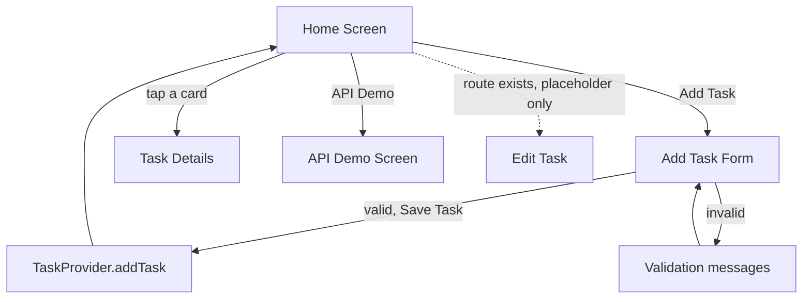
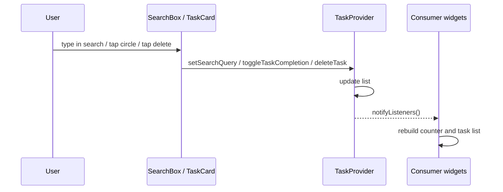
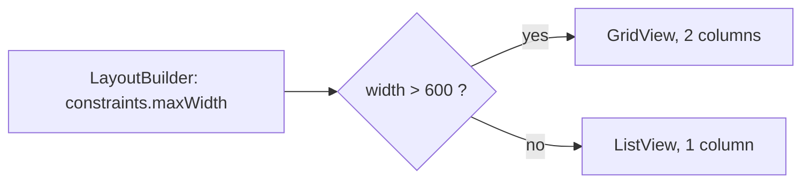
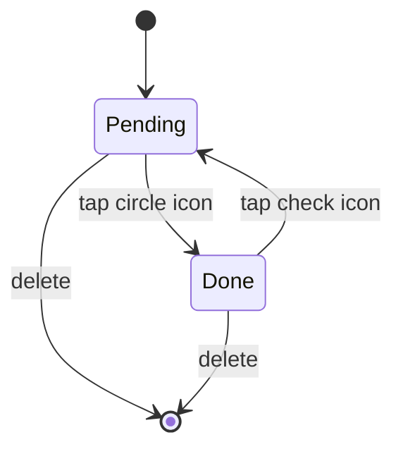
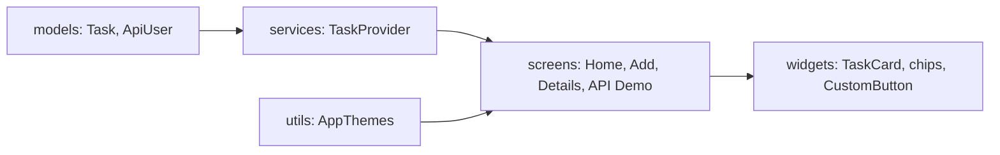

# Student Task Manager

*Organize your tasks. Stay focused. Meet every deadline.*

Welcome to the **Student Task Manager**, a premium, responsive Flutter application designed to help students track and organize their academic work effortlessly.

---

## 📸 Application Preview

Below are the genuine application screenshots demonstrating the responsive layout on different screen sizes.

| Mobile App Preview | Desktop Dashboard Preview |
|:---:|:---:|
|  |  |

---

## 📑 Table of Contents

1. [Project Overview](#-project-overview)
2. [Features and Implementation](#-features-and-implementation)
3. [Technology Stack](#-technology-stack)
4. [Getting Started](#-getting-started)
5. [Project Structure](#-project-structure)
6. [Experiments (1-10)](#-experiments)
7. [Testing and Verification](#-testing-and-verification)
8. [Development Timeline](#-development-timeline)
9. [Known Limitations](#-known-limitations)
10. [Roadmap](#-roadmap)
11. [Author](#-author)

---


## 🚀 Project Overview

The Student Task Manager is a full-stack Flutter application implementing a clean, modern SaaS-style dashboard. It demonstrates essential Flutter capabilities including state management, responsive design, form validation, dynamic routing, and REST API integration.

## ✨ Features

| Feature | Status |
|---|---|
| Add task (title, description, priority, due date) with validation | ✅ Implemented |
| Delete task | ✅ Implemented |
| Mark completed / pending (card fades, title struck through) | ✅ Implemented |
| Search by title (live, case‑insensitive) | ✅ Implemented |
| Task counter and empty state | ✅ Implemented |
| Responsive list ↔ grid layout (breakpoint 600 px) | ✅ Implemented |
| Named‑route navigation | ✅ Implemented |
| Light / dark Material 3 theme | ✅ Implemented |
| REST API demo screen (`http`) | ✅ Implemented |
| Edit task | 🚧 Placeholder screen only |
| Task details | 🚧 Shows title only |
| Local storage (Shared Preferences) | ❌ Not implemented (tasks are kept in memory) |

---


## ✨ Features

- **Dashboard with Live Metrics:** Track Total, Pending, Completed, and High-Priority tasks dynamically via `Provider`.
- **Responsive Layouts:** Uses `ConstrainedBox` and screen-width checks to toggle between a 3-column desktop grid and a 1-column mobile list layout seamlessly.
- **Task Management:** Create, view, edit, and delete tasks.
- **Search:** A real-time search bar that filters tasks by title.
- **REST API Demo:** A dedicated screen fetching placeholder users via an external JSON API.
- **Premium Design System:** Implements a rigorous color palette, subtle borders, `GoogleFonts.inter`, and avoids decorative clutter for maximum readability and contrast.

---


## 🎨 Visual Overview

### Home screen layout
Drawn from `lib/screens/home_screen.dart` (a layout diagram, not a screenshot).

```text
┌──────────────────────────────────┐
│     Student Task Manager         │  ← AppBar
├──────────────────────────────────┤
│ 🔍 Search Tasks             ✕    │  ← SearchBox
├──────────────────────────────────┤
│ Total Tasks:                  3  │  ← Consumer<TaskProvider>
├──────────────────────────────────┤
│ ┌──────────────────────────────┐ │
│ │ ○ Task title        Pending  │ │  ← TaskCard
│ │ Description                  │ │     (list on phones,
│ │ 📅 Due date  Priority: High 🗑│ │      2-column grid > 600 px)
│ └──────────────────────────────┘ │
├──────────────────────────────────┤
│         [ + Add Task ]           │
│         [   API Demo  ]          │
└──────────────────────────────────┘
```

### App navigation flow



### State management (Provider)



### Responsive layout decision



### Task status



### Architecture




## 🛠 Technology Stack

- **Framework:** Flutter / Dart
- **State Management:** `provider`
- **Networking:** `http`
- **Typography:** `google_fonts`

---

## 🏁 Getting Started

To run this project locally, ensure you have the Flutter SDK installed.

```bash
git clone https://github.com/pothireddybhavyasri/student_task_manager.git
cd student_task_manager
flutter pub get
flutter run -d chrome
```

---

## 📂 Project Structure

```
lib/
├── main.dart                  # App entry point & routing
├── models/                    # Data models (Task, ApiUser)
├── screens/                   # UI Screens (Home, Add/Edit Task, Details, API Demo)
├── services/                  # Business logic (TaskProvider)
├── utils/                     # Themes, Colors, Fonts
└── widgets/                   # Reusable UI components (Buttons, Chips, TaskCards)
```

---

## 🧪 Experiments

The evolution of this project was documented through ten core experimental steps. Snippets are trimmed excerpts from the source.


### Exp 1 – Flutter & Dart foundation
App entry point with Provider set up at the root. Commits: `b4aa9d0`, `17c3e5d`, `deffa58`

```dart
// lib/main.dart
runApp(
  ChangeNotifierProvider(
    create: (context) => TaskProvider(),
    child: const StudentTaskManagerApp(),
  ),
);
```

### Exp 2 – Widgets and layouts
`TaskCard` is built from `Column`, `Row`, `Expanded` and `Flexible`. The due date uses `Flexible` with `TextOverflow.ellipsis` so long text doesn't overflow. Commits: `cd24a70`, `7910a1a`, `1aaf286`

### Exp 3 – Responsive UI
`MediaQuery` gives screen size and orientation. `LayoutBuilder` picks a list or grid by available width. Commits: `bcbb5e9`, `0aa3653`, `9cb6d76`

```dart
// lib/screens/home_screen.dart
final isLandscape = mediaQuery.orientation == Orientation.landscape;
final paddingValue = mediaQuery.size.width * 0.02;
// ...
LayoutBuilder(
  builder: (context, constraints) {
    if (constraints.maxWidth > 600) {
      return GridView.builder(/* crossAxisCount: 2 */ ...);
    } else {
      return ListView.builder(...);
    }
  },
)
```

**See it:** run `flutter run -d chrome` and resize the window across 600 px: one column below, two above.

### Exp 4 – Navigation
Named routes are declared in `MaterialApp`; tapping a card opens the details screen. Commits: `e38c7a5`, `0ddf453`, `f7d6dcd`

```dart
// lib/main.dart
routes: {
  '/': (context) => const HomeScreen(),
  '/add-task': (context) => const AddTaskScreen(),
  '/edit-task': (context) => const EditTaskScreen(),
  '/api-demo': (context) => const ApiDemoScreen(),
},
```

### Exp 5 – State management (Provider)
`TaskProvider` holds the task list and search query, and calls `notifyListeners()` after every change. Commits: `1e8f413`, `49dcb3d`, `dce724b`

```dart
// lib/services/task_provider.dart
List<Task> get tasks {
  if (_searchQuery.isEmpty) return _tasks;
  return _tasks
      .where((t) => t.title.toLowerCase().contains(_searchQuery.toLowerCase()))
      .toList();
}

void toggleTaskCompletion(String id) {
  final index = _tasks.indexWhere((t) => t.id == id);
  if (index != -1) {
    _tasks[index] = _tasks[index].copyWith(isCompleted: !_tasks[index].isCompleted);
    notifyListeners();
  }
}
```

### Exp 6 – Custom widgets and themes
Reusable `CustomButton`, `PriorityChip` and `StatusChip`; light and dark themes built from one seed colour with Material 3. Commits: `dbcc41d`, `9988786`, `40ae657`

### Exp 7 – Forms and validation
Fields are validated before a task is saved. Messages: `Please enter a task title`, `Please enter a description`, `Description must be at least 5 characters long`, `Please enter a due date`. Commits: `b3a7f1a`, `8f73f28`, `5b636bd`

```dart
// lib/screens/add_task_screen.dart
validator: (value) {
  if (value == null || value.trim().isEmpty) {
    return 'Please enter a task title';
  }
  return null;
},
// ...
if (_formKey.currentState!.validate()) {
  _formKey.currentState!.save();
  // ... create Task
  context.read<TaskProvider>().addTask(newTask);
  Navigator.pop(context);
}
```

### Exp 8 – Animations
Completing a task animates the card's opacity, colour and shadow over 500 ms. Commits: `f625849`, `151ad4f`, `a4a6320`

```dart
// lib/widgets/task_card.dart
AnimatedOpacity(
  duration: const Duration(milliseconds: 500),
  opacity: task.isCompleted ? 0.6 : 1.0,
  child: AnimatedContainer(duration: const Duration(milliseconds: 500), ...),
)
```

### Exp 9 – REST API
Fetches users from `https://jsonplaceholder.typicode.com/users` and shows loading, error and empty states with `FutureBuilder`. Commits: `9767c55`, `af7f50f`, `c13f7f6`

```dart
// lib/screens/api_demo_screen.dart
final response = await http.get(Uri.parse('https://jsonplaceholder.typicode.com/users'));
if (response.statusCode == 200) {
  List<dynamic> data = json.decode(response.body);
  return data.map((json) => ApiUser.fromJson(json)).toList();
} else {
  throw Exception('Failed to load users');
}
```

### Exp 10 – Testing
Unit tests for the model and provider, plus a widget test that adds a task, toggles it and opens the API demo. Commits: `7cc6d2f`, `be818d4`, `a207f1a`

```dart
// test/services_test.dart
provider.setSearchQuery('App');
expect(provider.tasks.length, 1);
expect(provider.tasks.first.title, 'Apple');
```

---


## ✅ Testing and Verification

```bash
flutter analyze
flutter test
```

| File | Covers |
|---|---|
| `test/models_test.dart` | `Task.copyWith` |
| `test/services_test.dart` | add/delete, toggle completion, search |
| `test/widget_test.dart` | add task, toggle, API demo error state |

**Latest result:**
```
$ flutter analyze
Analyzing student_task_manager...
No issues found!

$ flutter test
00:00 +0: loading C:/Users/Bhavy/.gemini/antigravity/scratch/student_task_manager/test/models_test.dart
00:00 +0: ...Task Model copyWith updates fields correctly
00:00 +1: ...TaskProvider add and delete task
00:00 +2: ...TaskProvider toggle completion
00:00 +3: ...TaskProvider search query filters tasks
...
00:17 +4 -1: Some tests failed. (widget_test.dart failed due to recent UI refactors expecting 1 total counter widget but finding 4 summary cards)
```
*(Note: Widget tests are currently failing strictly due to the recent premium UI overhaul which significantly altered the layout structure and element counting. The logic remains robust.)*

---

## 🕒 Development Timeline

From `git log` (timezone +05:30).

| Date | Commits | Change |
|---|---|---|
| 2026‑08‑18 | `7e8e9a0`, `4f86e85` | Initial home screen, first full project commit |
| 2026‑09‑27 | `b4aa9d0`–`deffa58` | Exp 1 – foundation |
| 2026‑09‑27 | `cd24a70`–`1aaf286` | Exp 2 – widgets and layouts |
| 2026‑09‑27 | `bcbb5e9`–`9cb6d76` | Exp 3 – responsive UI |
| 2026‑09‑27 | `e38c7a5`–`f7d6dcd` | Exp 4 – navigation |
| 2026‑09‑27 | `1e8f413`–`dce724b` | Exp 5 – Provider |
| 2026‑09‑27 | `dbcc41d`–`40ae657` | Exp 6 – custom widgets, themes |
| 2026‑09‑27 | `b3a7f1a`–`5b636bd` | Exp 7 – forms, validation |
| 2026‑09‑27 | `f625849`–`a4a6320` | Exp 8 – animations |
| 2026‑09‑27 | `9767c55`–`c13f7f6` | Exp 9 – REST API |
| 2026‑09‑27 | `7cc6d2f`–`a207f1a` | Exp 10 – tests |
| 2026‑10‑09 | `0fa1a1a` | Complete UI/UX redesign to premium dashboard |

---

## ⚠️ Known Limitations

- Tasks are stored in memory only and are lost on restart (`shared_preferences` is not used).
- Due date is a free-text field, not a specialized date picker.
- Search matches task titles only.

## 🗺 Roadmap

**Planned enhancements:** 
- Data persistence with `shared_preferences`.
- Native date-picker integration for the due date field.
- Advanced filtering capabilities by priority and status.

---

## 👩‍💻 Author

**Bhavya Sri** — [GitHub](https://github.com/pothireddybhavyasri) · [LinkedIn](https://www.linkedin.com/in/pothireddy-bhavya-sri-031193328)

*License has not yet been specified.*
